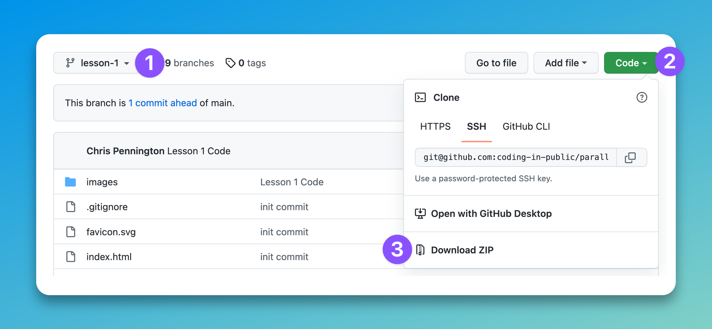

# Parallax Landing Page Build

During the course of this series, we’ll use HTML, TailwindCSS, and vanilla JavaScript to create a responsive, parallax landing page.

## Lesson Help
If you get stuck on any lesson in the series, navigate to the course branch for your current lesson and view or download the code for more help.

## Assumptions
In this series, I’ll assume you have a working knowledge of both Tailwind CSS and JavaScript. If you need help, see the Net Ninja’s introductory series on either topic.

## Helpful Links
- My YouTube Channel: https://www.youtube.com/c/CodinginPublic
- Accompanying Free Figma Course: https://youtu.be/2liZ3uvO9bs

## Connect With Me
- Website: https://codinginpublic.dev
- Blog: https://chrispennington.blog
- Twitter: https://twitter.com/cpenned
- Patreon: https://www.patreon.com/coding_in_public

